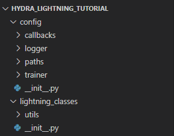
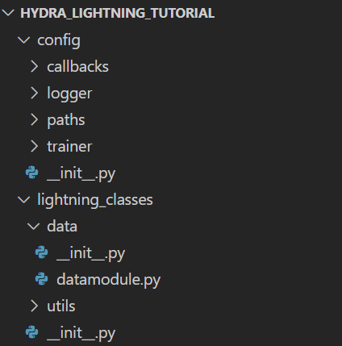
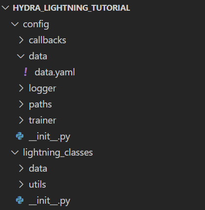
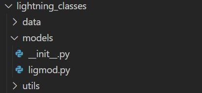
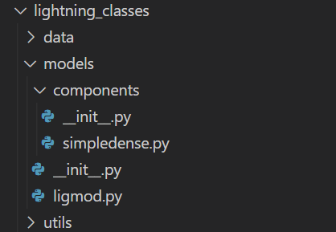
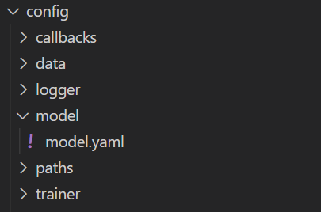
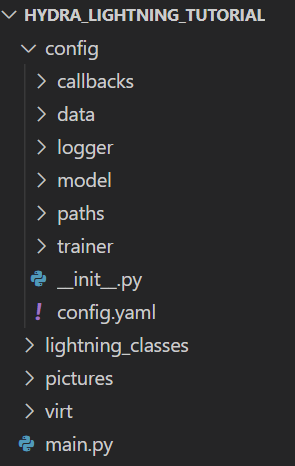

# Hydra Lightning Tutorial
Git clone the following [git repository](https://github.com/ephkrj/hydra_lightning_tutorial.git) which includes the initialisation for some of the core functionalities of hydra e.g. the default logger, utils library that were previously provided by the base lightning hydra template.
You should have the following folder layout after cloning the files:



## Creating LightningDataModules
The following is a typical setup of a lightningdatamodule:
```python
from lightning import LightningDataModule
from typing import Optional
from torch.utils.data import Dataset

class DataModule(LightningDataModule):
    def __init__(self, 
    train_val_test_split: None, 
    data_dir: 'data/',
    batch_size: 32,
    num_worker: 1,
    pin_memory: True
    ): # include some set of parameters; linked to subsequent data config file.
        super().__init__()
        # allows access to 'self.hparams', which configured by the data config file.
        self.save_hyperparameters(logger=False)
        # initialising train/val/test data
        self.data_train: Optional[Dataset] = None
        self.data_val: Optional[Dataset] = None
        self.data_test: Optional[Dataset] = None
```
After which there are eight mandatory methods for the lightningdatamodule to be filled, namely `prepare_data`

```python
import pandas as pd

def prepare_data(self):
    """ 
    to load/download data and prep data with data processing (if needed).
    """
    self.data = pd.read(self.hparams.data_dir)
    # data transformation here
```
`setup`
```python
import torch
from torch.utils.data import random_split

def setup(self):
    # load train, val and test data if it has not been setup
    if not self.data_train and not self.data_val and not self.data_test:
        self.data_train, self.data_val, self.data_test = random_split(
            dataset = self.data, 
            lengths=self.hparams.train_val_test_split,
            generator=torch.Generator().manual_seed(42)
        )
```
`train_dataloader`
```python
from torch.utils.data import DataLoader
def train_dataloader(self):
    return DataLoader(
        dataset=self.data_train,
        batch_size=self.hparams.batch_size,
        num_workers=self.hparams.num_workers,
        pin_memory=self.hparams.pin_memory,
        shuffle=True,
    )
```
`val_dataloader`
```python
def val_dataloader(self):
    return DataLoader(
        dataset=self.data_val,
        batch_size=self.hparams.batch_size,
        num_workers=self.hparams.num_workers,
        pin_memory=self.hparams.pin_memory,
        shuffle=False,
    )
```
`test_dataloader`
```python
def test_dataloader(self):
    return DataLoader(
        dataset=self.data_test,
        batch_size=self.hparams.batch_size,
        num_workers=self.hparams.num_workers,
        pin_memory=self.hparams.pin_memory,
        shuffle=False,
    )
```
`teardown`
```python
def teardown(self, stage: Optional[str] = None):
    """Clean up after fit or test."""
    pass
```
`state_dict`
```python
def state_dict(self):
    """Extra things to save to checkpoint."""
    return {}
```
and `load_state_dict`.
```python
from typing import Dict, Any

def load_state_dict(self, state_dict: Dict[str, Any]):
    """Things to do when loading checkpoint."""
    pass
```
putting everything together, we get `datamodule.py`:
```python
from lightning import LightningDataModule
from typing import Optional, Dict, Any
from torch.utils.data import Dataset, DataLoader, random_split
import pandas as pd
import torch

class DataModule(LightningDataModule):
    def __init__(self, 
    train_val_test_split: None, 
    data_dir: 'data/',
    batch_size: 32,
    num_worker: 1,
    pin_memory: True
    ): # include some all parameters that needs to accessed by 'self.hparams'; linked to data config file.
        super().__init__()
        # allows access to 'self.hparams', which configured by the data config file.
        self.save_hyperparameters(logger=False)
        # initialising train/val/test data
        self.data_train: Optional[Dataset] = None
        self.data_val: Optional[Dataset] = None
        self.data_test: Optional[Dataset] = None

    def prepare_data(self):
        """ 
        to load/download data and prep data with data processing (if needed).
        """
        self.data = pd.read(self.hparams.data_dir)
        # data transformation here

    def setup(self):
        # load train, val and test data if it has not been setup
        if not self.data_train and not self.data_val and not self.data_test:
            self.data_train, self.data_val, self.data_test = random_split(
                dataset = self.data, 
                lengths=self.hparams.train_val_test_split,
                generator=torch.Generator().manual_seed(42)
            )

    def train_dataloader(self):
        return DataLoader(
            dataset=self.data_train,
            batch_size=self.hparams.batch_size,
            num_workers=self.hparams.num_workers,
            pin_memory=self.hparams.pin_memory,
            shuffle=True,
        )

    def val_dataloader(self):
        return DataLoader(
            dataset=self.data_val,
            batch_size=self.hparams.batch_size,
            num_workers=self.hparams.num_workers,
            pin_memory=self.hparams.pin_memory,
            shuffle=False,
        )

    def test_dataloader(self):
        return DataLoader(
            dataset=self.data_test,
            batch_size=self.hparams.batch_size,
            num_workers=self.hparams.num_workers,
            pin_memory=self.hparams.pin_memory,
            shuffle=False,
        )

    def teardown(self, stage: Optional[str] = None):
        """Clean up after fit or test."""
        pass

    def state_dict(self):
        """Extra things to save to checkpoint."""
        return {}

    def load_state_dict(self, state_dict: Dict[str, Any]):
        """Things to do when loading checkpoint."""
        pass

if __name__ == "__main__":
    _ = DataModule()
```
Then add `datamodule.py` in a `data` folder, under `lightning_classes`:



Next, attach a corresponding config yaml file for each of the `self.hparams` in the datamodule.
```yaml
_target_: lightning_classes.data.datamodule.DataModule
data_dir: ${paths.data_dir}/data.csv
train_val_test_split: [10000, 4000, 2000]
batch_size: 32
num_workers: 1
pin_memory: True
```
Call this file `data.yaml` and include it in a `data` folder under `config`:



## Creating LightningModules
Similar to how we did for the lightningdatamodule, we break down the lightningmodule into several parts, beginning with the initialisation of the lightningmodule class:
```python
from lightning import LightningModule
import torch
from torchmetrics import MeanMetric
from torchmetrics.classification.accuracy import Accuracy

class LigMod(LightningModule):
    def __init__(
        self,
        net: torch.nn.Module,
        optimizer: torch.optim.Optimizer,
        scheduler: torch.optim.lr_scheduler
    ):
        super().__init__()
        self.save_hyperparameters(logger=False)
        self.net = net
        # loss function
        self.criterion = torch.nn.CrossEntropyLoss()
        # metric objects for calculating and averaging accuracy across batches
        self.train_acc = Accuracy(task='binary', num_classes = 2)
        self.val_acc = Accuracy(task='binary', num_classes = 2)
        self.test_acc = Accuracy(task='binary', num_classes = 2)
        # for averaging losses across batches
        self.train_loss = MeanMetric()
        self.val_loss = MeanMetric()
        self.test_loss = MeanMetric()
```
Next, we include the mandatory methods needed for the lightningmodule:
`forward`
```python
def forward(self, x: torch.Tensor):
    return self.net(x)
```
`on_train_start`
```python
def on_train_start(self):
    # by default lightning executes validation step sanity checks before training starts,
    # so it's worth to make sure validation metrics don't store results from these checks
    self.val_loss.reset()
    self.val_acc.reset()
```
`model_step`
```python
from typing import Any
def model_step(self, batch: Any):
    x, y = batch
    logits = self.forward(x)
    loss = self.criterion(logits, y)
    preds = torch.argmax(logits, dim=1)
    return loss, preds, y
```
`training_step`
```python
def training_step(self, batch: Any, batch_idx: int):
    loss, preds, targets = self.model_step(batch)

    # update and log metrics
    self.train_loss(loss)
    self.train_acc(preds, targets)
    self.log("train/loss", self.train_loss, on_step=False, on_epoch=True, prog_bar=True)
    self.log("train/acc", self.train_acc, on_step=False, on_epoch=True, prog_bar=True)

    # return loss or backpropagation will fail
    return loss
```
`on_train_epoch_end`
```python
def on_train_epoch_end(self):
    pass
```
`validation_step`
```python
def validation_step(self, batch: Any, batch_idx: int):
    loss, preds, targets = self.model_step(batch)

    # update and log metrics
    self.val_loss(loss)
    self.val_acc(preds, targets)
    self.log("val/loss", self.val_loss, on_step=False, on_epoch=True, prog_bar=True)
    self.log("val/acc", self.val_acc, on_step=False, on_epoch=True, prog_bar=True)
```
`on_validation_epoch_end`
```python
def on_validation_epoch_end(self):
    pass
```
`test_step`
```python
def test_step(self, batch: Any, batch_idx: int):
    loss, preds, targets = self.model_step(batch)

    # update and log metrics
    self.test_loss(loss)
    self.test_acc(preds, targets)
    self.log("test/loss", self.test_loss, on_step=False, on_epoch=True, prog_bar=True)
    self.log("test/acc", self.test_acc, on_step=False, on_epoch=True, prog_bar=True)
```
`on_test_epoch_end`
```python
def on_test_epoch_end(self):
    pass
```
`configure_optimizers`
```python
def configure_optimizers(self):
    """Choose what optimizers and learning-rate schedulers to use in your optimization.
    Normally you'd need one. But in the case of GANs or similar you might have multiple.
    Examples:
        https://lightning.ai/docs/pytorch/latest/common/lightning_module.html#configure-optimizers
    """
    optimizer = self.hparams.optimizer(params=self.parameters())
    if self.hparams.scheduler is not None:
        scheduler = self.hparams.scheduler(optimizer=optimizer)
        return {
            "optimizer": optimizer,
            "lr_scheduler": {
                "scheduler": scheduler,
                "monitor": "val/loss",
                "interval": "epoch",
                "frequency": 1,
            },
        }
    return {"optimizer": optimizer}
```
Again, putting everything together, we have `ligmod.py`:
```python
from typing import Any
from lightning import LightningModule
import torch
from torchmetrics import MeanMetric
from torchmetrics.classification.accuracy import Accuracy

class LigMod(LightningModule):
    def __init__(
        self,
        net: torch.nn.Module,
        optimizer: torch.optim.Optimizer,
        scheduler: torch.optim.lr_scheduler
    ):
        super().__init__()
        self.save_hyperparameters(logger=False)
        self.net = net
        # loss function
        self.criterion = torch.nn.CrossEntropyLoss()
        # metric objects for calculating and averaging accuracy across batches
        self.train_acc = Accuracy(task='binary', num_classes = 2)
        self.val_acc = Accuracy(task='binary', num_classes = 2)
        self.test_acc = Accuracy(task='binary', num_classes = 2)
        # for averaging losses across batches
        self.train_loss = MeanMetric()
        self.val_loss = MeanMetric()
        self.test_loss = MeanMetric()

    def forward(self, x: torch.Tensor):
        return self.net(x)
    
    def on_train_start(self):
        # by default lightning executes validation step sanity checks before training starts,
        # so it's worth to make sure validation metrics don't store results from these checks
        self.val_loss.reset()
        self.val_acc.reset()

    def model_step(self, batch: Any):
        x, y = batch
        logits = self.forward(x)
        loss = self.criterion(logits, y)
        preds = torch.argmax(logits, dim=1)
        return loss, preds, y

    def training_step(self, batch: Any, batch_idx: int):
        loss, preds, targets = self.model_step(batch)

        # update and log metrics
        self.train_loss(loss)
        self.train_acc(preds, targets)
        self.log("train/loss", self.train_loss, on_step=False, on_epoch=True, prog_bar=True)
        self.log("train/acc", self.train_acc, on_step=False, on_epoch=True, prog_bar=True)

        # return loss or backpropagation will fail
        return loss

    def on_train_epoch_end(self):
        pass

    def validation_step(self, batch: Any, batch_idx: int):
        loss, preds, targets = self.model_step(batch)

        # update and log metrics
        self.val_loss(loss)
        self.val_acc(preds, targets)
        self.log("val/loss", self.val_loss, on_step=False, on_epoch=True, prog_bar=True)
        self.log("val/acc", self.val_acc, on_step=False, on_epoch=True, prog_bar=True)

    def on_validation_epoch_end(self):
        pass

    def test_step(self, batch: Any, batch_idx: int):
        loss, preds, targets = self.model_step(batch)

        # update and log metrics
        self.test_loss(loss)
        self.test_acc(preds, targets)
        self.log("test/loss", self.test_loss, on_step=False, on_epoch=True, prog_bar=True)
        self.log("test/acc", self.test_acc, on_step=False, on_epoch=True, prog_bar=True)

    def on_test_epoch_end(self):
        pass

    def configure_optimizers(self):
        """Choose what optimizers and learning-rate schedulers to use in your optimization.
        Normally you'd need one. But in the case of GANs or similar you might have multiple.
        Examples:
            https://lightning.ai/docs/pytorch/latest/common/lightning_module.html#configure-optimizers
        """
        optimizer = self.hparams.optimizer(params=self.parameters())
        if self.hparams.scheduler is not None:
            scheduler = self.hparams.scheduler(optimizer=optimizer)
            return {
                "optimizer": optimizer,
                "lr_scheduler": {
                    "scheduler": scheduler,
                    "monitor": "val/loss",
                    "interval": "epoch",
                    "frequency": 1,
                },
            }
        return {"optimizer": optimizer}

if __name__ == "__main__":
    _ = LigMod(None, None, None)
```
And add the file under `models` in the `lightning_classes` folder:



Before we create a config file for our model, we create supplementary script(s) that let us specify our model setup in greater detail. For example, here we can create another python script that indicates what kind of neural network we are running:
```python
from torch import nn

class SimpleDenseNet(nn.Module):
    def __init__(
        self,
        input_size: int = 784,
        lin1_size: int = 256,
        output_size: int = 2,
    ):
        super().__init__()

        self.model = nn.Sequential(
            nn.Linear(input_size, lin1_size),
            nn.BatchNorm1d(lin1_size),
            nn.ReLU(),
            nn.Linear(lin1_size, output_size),
        )

    def forward(self, x):
        batch_size, channels, width, height = x.size()

        # (batch, 1, width, height) -> (batch, 1*width*height)
        x = x.view(batch_size, -1)

        return self.model(x)


if __name__ == "__main__":
    _ = SimpleDenseNet()
```
Then place this script `simpledense.py` under the components folder:



Then we specify the model config yaml file, pointing to both the lightningmodule and the specific neural net that we want to train on:
```yaml
_target_: lightning_classes.models.ligmod.LigMod

optimizer:
  _target_: torch.optim.Adam
  _partial_: true
  lr: 0.001
  weight_decay: 0.0

scheduler:
  _target_: torch.optim.lr_scheduler.ReduceLROnPlateau
  _partial_: true
  mode: min
  factor: 0.1
  patience: 10

net:
  _target_: lightning_classes.models.components.simpledense.SimpleDenseNet
  input_size: 784
  lin1_size: 64
  output_size: 2
```
And add the yaml file into the `model` folder in `config`:



## `main.py`: Main script to execute training

```python
from typing import List
import hydra
from lightning import Callback, LightningDataModule, LightningModule, Trainer
from omegaconf import DictConfig
from lightning_classes import utils
from lightning.pytorch.loggers import Logger

@hydra.main(config_path="config/", config_name="config.yaml", version_base = "1.2")
def main(cfg: DictConfig):
    # logger and callbacks setup
    logger: List[Logger] = utils.instantiate_loggers(cfg.get("logger"))
    callbacks: List[Callback] = utils.instantiate_callbacks(cfg.get("callbacks"))
    # instantiate datamodule, model and trainer components
    datamodule: LightningDataModule = hydra.utils.instantiate(cfg.data)
    model: LightningModule = hydra.utils.instantiate(cfg.model)
    trainer: Trainer = hydra.utils.instantiate(cfg.trainer, logger=logger, callbacks= callbacks)
    # trainer would carry out training based on the parameters indicated in the trainer config file
    trainer.fit(model=model, datamodule=datamodule)

if __name__ == "__main__":
    main()
```
And `main.py` falls back on the main config file `config.yaml`:
```yaml
defaults:
  - model: model.yaml
  - data: data.yaml
  - trainer: trainer.yaml
  - callbacks: default.yaml
  - logger: mlflow.yaml
  - paths: default.yaml
  - _self_
```
with the final directory layout:



to run a single instance of training based on the default configurations, run 
```bash 
python main.py
```
in an open terminal. To modify parameters for a particular training instance, simply indicate in the command line:
```bash
python main.py model.optimizer.lr=5e-3
```
for the example above, it would run the training instance with a learning rate of 0.005, instead of the default value of 0.001. Adding the `multirun` flag would create multiple instances where hydra will carry out training based on the input parameters:
```bash
python main.py --multirun model.optimizer.lr=5e-3,5e-4
```
## Creating individual experiments
We can also carry out experiments e.g. testing out new models etc just by creating new config files that contain modified configurations. For this example, suppose we are testing out a new model configuration that is specified by the `experimental_model.yaml`. We then create `new_experiment.yaml` file and place it under the `experiment` folder:
```yaml
# @package _global_
defaults:
  - override /model: experimental_model #some other yaml config file with cofigurations for the experiment. Include the experimental_model yaml file under the model folder.

# change other hyperparameters here 
logger.experiment_name: experimental_model
```
To run this experiment, run the following:
```bash
python main.py experiment=new_experiment
```

